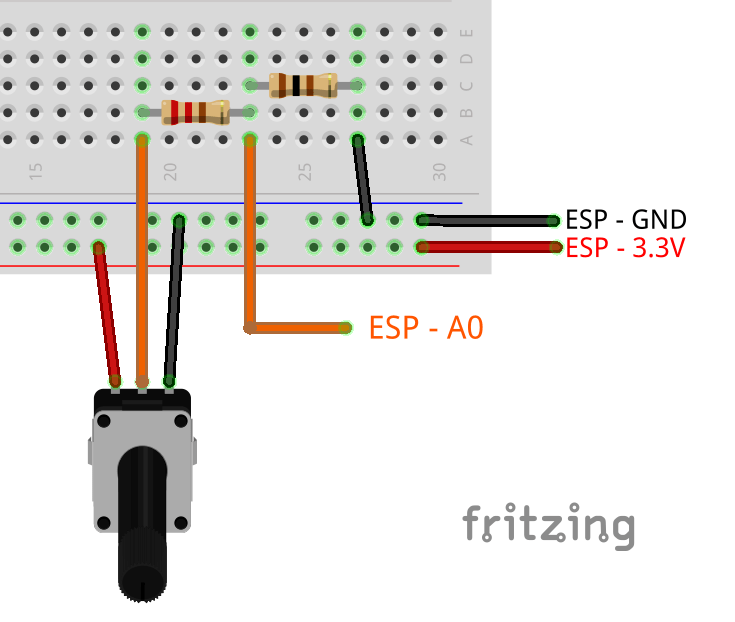
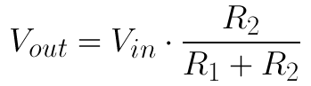
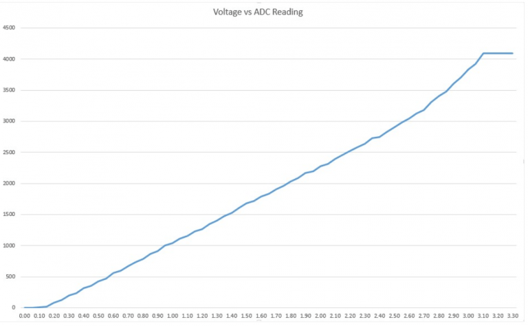

# Algemene informatie mbt de ESP32


  * [Kolban's book on ESP32](https://leanpub.com/kolban-ESP32) COMPLETED ON 2018-09-02


## Pinout en beschrijving van de functies

  1. [ESP32 Pinout Reference: Which GPIO pins should you use?](https://randomnerdtutorials.com/esp32-pinout-reference-gpios/)
  2. [ESP32 Wroom32 DevKit Analog Read Example](https://circuits4you.com/2018/12/31/esp32-wroom32-devkit-analog-read-example/)
  8. [**ESP32/ESP8266 Analog Readings with MicroPython**](https://randomnerdtutorials.com/esp32-esp8266-analog-readings-micropython/)


## Meten van Wisselspanning

  3. [https://forum.pycom.io/topic/2384/measuring-current-with-the-adc/4](https://forum.pycom.io/topic/2384/measuring-current-with-the-adc/4)
  4. [AC Voltage measurement using PIC16F877A microcontroller](https://microcontrollerslab.com/ac-voltage-measurement-using-microcontroller/)
  5. [ac voltage measurement using Arduino: ac voltage detector](https://microcontrollerslab.com/ac-voltage-measurement-arduino/)


## Filteren van signaal

  6. [THREE METHODS TO FILTER NOISY ARDUINO MEASUREMENTS
](https://www.megunolink.com/articles/coding/3-methods-filter-noisy-arduino-measurements/)
  7. ESP32 [[Answered] What are the ADC input ranges?](https://www.esp32.com/viewtopic.php?t=1045) Opmerking: een erg *nuttig topic!*


## ADC

Overgenomen uit 8.


The following table shows some differences between analog reading on the ESP8266 and the ESP32.

| | ESP8266 | ESP32 |
-------------- | ---------------------------- | ----------------------------
Analog pins | A0 (ADC 0) | GPIOs: 0, 2, 4, 12, 13, 14, 15,25, 26, 27, 32, 33, 34, 35, 36,and 39.
Resolution | 10-bit (0-1023) | 12-bit (0-4095)
Change resolution | No | Yes

If you’re using an ESP8266 chip with input voltage range of 0V to 1V, you need to make sure that the input voltage on the A0 pin doesn’t exceed 1V. So, you need a voltage divider circuit, as shown below.



ESP8266 ADC read analog value circuit
We’re using a 100 Ohm and a 220 Ohm resistor, so that the Vout is 1V.




Overgenomen uit 1.

Note: ADC2 pins cannot be used when Wi-Fi is used. So, if you’re using Wi-Fi and you’re having trouble getting the value from an ADC2 GPIO, you may consider using an ADC1 GPIO instead, that should solve your problem.

The ADC input channels have a 12 bit resolution. This means that you can get analog readings ranging from 0 to 4095, in which 0 corresponds to 0V and 4095 to 3.3V. You also have the ability to set the resolution of your channels on the code, as well as the ADC range.

The ESP32 ADC pins don’t have a linear behavior. You’ll probably won’t be able to distinguish between 0 and 0.1V, or between 3.2 and 3.3V. You need to keep that in mind when using the ADC pins. You’ll get a behavior similar to the one shown in the following figure.



Overgenomen uit 2. 

The ESP32 has an analog  to digital converter built into it with a resolution of up to 12 bits which is 4096 distinct values. What that means is that 0 volts will produce a digital value of 0 while the maximum voltage will produce a digital value of 4095 and voltage ranges between these will produce a correspondingly scaled digital value.One of the properties on the analog to digital converter channels is attenuation. This is a voltage scaling factor. Normally the input range is 0-1V but with different attenuations we can scale the input voltage in to this range. The available scales beyond the 0-1V include 0-1.34V, 0-2V and 0-3.6V.

Overgenomen uit 3.

I did some testing myself, using a function generator as input source. Finding: the ADC is not good, but about usable for your purpose. It is noisy and nonlinear, but some of the nois seen also results from the varying IRQ response latency of the firmware. Some hints.

  * Devices with a rev1 chip perform better, so use this one. But there is a big variation between individual devices. But with respect to noise the Pycom boards are better than, let's say, the Wemos boards.
  * *Add a low impedance capacitor* (ceramic) of like 10nF as close as possible to the ADC input between input and GND, with short leads. That reduces the noise.
  * If possible, use the 6dB attenuation mode. That requires an additional 2:1 voltage divider, but gives better linearity. You will need some analog filtering anyhow to protect the inputs of the ESP32 from spikes. This is not shown in the schematics below. The sample code below uses 11db attenuation.
  * My test code is below. It uses a timer for acquisition to get regular sampling, and uses the sin2 + cos2 approach to determine the amplitude. The value for noise is what you get with no signal.


Overgenomen uit 6.

You can hardly expect good results from embeded ADC on any microcontroller. Some software techniques must always be used to improve the results.
There are many documents about that, here are some links:
http://www.st.com/content/ccc/resource/ ... 004444.pdfhttp://www.st.com/content/ccc/resource/ ... 050879.pdf
http://www.atmel.com/images/doc8003.pdf
http://www.embedded.com/design/mcus-pro ... resolution
http://www.eurasip.org/Proceedings/Ext/ ... _III_5.pdf

Some of these techniques will eventually be used in esp-idf, or you can implement them yourself.

### Speciaal voor Pycom ESP32 controllers

Zie [ADC](https://docs.pycom.io/tutorials/all/adc.html)

**ADC**
This example is a simple ADC sample. For more information please see ADC.

```
from machine import ADC
adc = ADC(0)
adc_c = adc.channel(pin='P13')
adc_c()
adc_c.value()
```

**Calibration**
Currently the ESP32's ADC is not calibrated from the factory. This means it must be calibrated each time you wish to use it. To do this you must firstly measure the internal voltage reference. The following code will connect the 1.1v reference to P22

```
from machine import ADC
adc = ADC()

# Output Vref of P22
adc.vref_to_pin('P22')
```

Now that the voltage reference is externally accessible you should measure it with the most accurate voltmeter you have access to. Note down the reading in millivolts, e.g. 1120. To disconnect the 1.1v reference from P22 please reset your module. You can now calibrate the ADC by telling it the true value of the internal reference. You should then check your calibration by connecting the ADC to a known voltage source.

```
# Set calibration - see note above
adc.vref(1100)

# Check calibration by reading a known voltage
adc_c = adc.channel(pin='P16', attn=ADC.ATTN_11DB)
print(adc_c.voltage())
```

**Digital Outputs**

NB. de GPIO pinnen kunnen gewoon op (logische) volgorde worden aangestuurd. Maar... let wel op de aansluiting op het board: hier zitten de (logische) pinnen niet op volgorde. Dus [dit Arduino software voorbeeld](https://tutorial45.com/arduino-projects-arduino-decibel-meter/) werkt ook op de ESP32 met MicroPython.

To set a GPIO on or off, first you need to set it as an output. For example:

```
led = Pin(5, Pin.OUT)
```
To control the GPIO, use the value() method on the Pin object and pass 1 or 0 as argument. For example, the following command sets a Pin object (led) to HIGH:

```
led.value(1)
```
To set the GPIO to LOW, pass 0 as argument:

```
led.value(0)
```

## Voorbeeld met ADC en GPIO's

https://randomnerdtutorials.com/micropython-gpios-esp32-esp8266/
