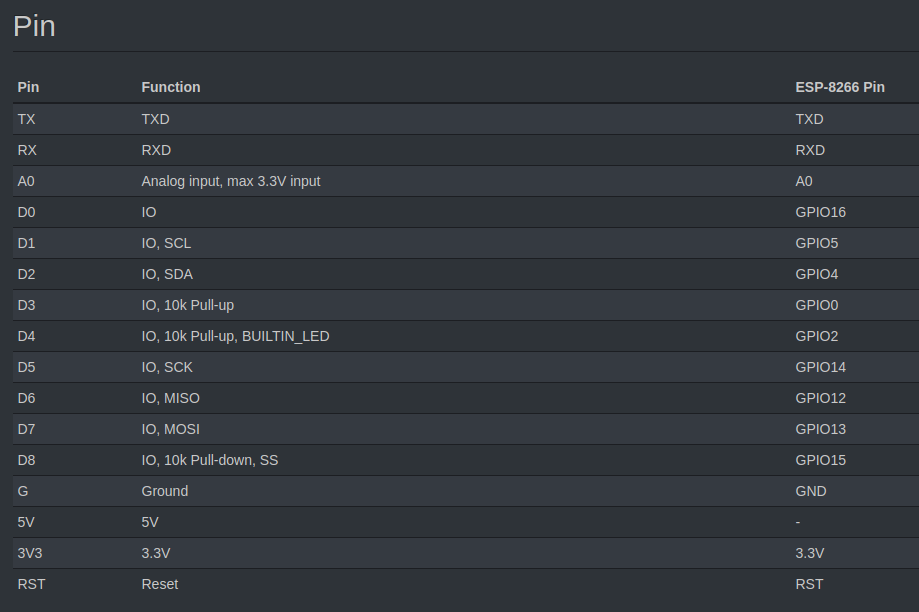

# Wemos D1 Mini V3 - ESP8266 - CH340


## Intro 

Deze Wemos D1 mini V3 is in principe een handig breakout board van de ESP8266 chip. Door de CH340 USB naar serieel converter is hij gemakkelijk te programmeren, ook als een Arduino.
Het board heeft een micro USB aansluiting waarmee hij geprogrameerd en/of gevoed kan worden. (micro USB kabel niet meegeleverd)
Dit board beschikt over de ESP8266 chip met 4MB flash geheugen.
Deze derde versie van de D1 Mini heeft een iets verbeterde printplaat met onder andere een montagegat(2mm) en een mogelijkheid om de deepsleep pin direct te verbinden(soldeerbrug) met de reset pin.

Wil je het board als Arduino gebruiken, begin dan hier. 

De pinnen op het board zitten rechtstreeks aangesloten op de ESP8266 chip en zijn dus alleen geschikt voor 3.3V signalen.
Er worden een aantal pin headers meegeleverd. (zie afbeeldingen)


## Version

3.1.0


## Features

* 11 digital input/output pins, all pins have interrupt/pwm/I2C/one-wire supported(except D0)
* 1 analog input(3.2V max input)
* a Micro USB connection
* Compatible with MicroPython, Arduino, nodemcu

## Specifications

* Microcontroller: ESP-8266EX
* Operating Voltage: 3.3V
* Digital I/O Pins: 11
* Analog Input Pins: 1(Max input: 3.2V)
* Clock Speed: 80MHz/160MHz
* Flash: 4M bytes
* Lengte: 34.2mm
* Breedte: 25.6mm
* Gewicht: 10g


## Pinout



Below is a quick reference guide to Wemos D1 pin mapping for GPIO, I2C and SPI when working from MicroPython.

### Pin mapping

The visible pin numbers written on the Wemos D1 does not relate to the internal pin numbering. In MicroPython you need to use the internal pin numbers to create your Pin objects and interface with the pins. The following table shows the internal to external pin mapping — together with the default hardware level functions for the given pin.

Wemos D1 | ESP8266  | Pin Functions
------------- | ------------- | ------------- 
D0 | 16 | GPIO
D1 | 5 | GPIO, I2C SCL
D2 | 4 | GPIO, I2C SDA
D3 | 0 | GPIO
D4 | 2 | GPIO
D5 | 14 | GPIO, SPI SCK (Serial Clock)
D6 | 12 | GPIO, SPI MISO (Master in, Slave out)
D7 | 13 | GPIO, SPI MOSI (Master out, Slave in)
D8 | 15 | GPIO, SPI SS (Slave select)
A0 | A0 | Analog in, via ADC
RX | 3 | Receive
TX | 1 | Transmit

	The hardware I2C positions can be ignored in MicroPython, since the protocol is only available through a software implementation which works on all GPIO pins.

So, for example if you want to use pin D6 for output, you could create the interface within MicroPython as follows:

```
import machine
d6 = machine.Pin(12, Pin.OUT)
```

The Wemos D1 only provides a single analogue input pin, which is accessed by it's ADC (referenced as 0).

```
import machine
adc = machine.ADC(0)
```

### I2C

The I2C ports in the table above reflect the pins where hardware I2C is available on ESP8266. However, this is not currently accessible from MicroPython. Instead MicroPython offers a software I2C implementation accomplished by bit-banging, on any combination of GPIO pins. I usually stick them in the same place regardless —

```
from machine import I2C
i2c = I2C(-1, scl=Pin(5), sda=Pin(4))
```

	The -1 indicates to MicroPython to use the software I2C implementation.

You can provide any GPIO pins passing in to the scl and sda parameters.

i2c = I2C(-1, scl=Pin(12), sda=Pin(13))  # create I2C using ports D6 and D7 for SCL and SDA respectively

### SPI

SPI (Serial Peripheral Interface Bus) is a simple protocol, where master and slave device are linked by three data lines MISO (Master in, Slave out), MOSI (Master out, Slave in), SCK (Serial clock, also see as M-CLK)

	The SS (Slave select) line is used to control communication with multiple slaves, for more information see this writeup here.

MicroPython provides both software and hardware SPI implementations both via the machine.SPI class.

To use the hardware implementation of SPI, pass in 1 for the first parameter. Pins M-CLK, MISO, MOSI (and SS) will end up on the pins shown in the table (D5, D6, D7 and D8 respectively).

```
from machine import Pin, SPI
spi = SPI(1, baudrate=80000000, polarity=0, phase=0)
```

The software implementation can be used by passing -1 as the first parameter, and pins to use for sck, mosi and miso.

```
from machine import Pin, SPI
spi = SPI(-1, baudrate=100000, polarity=1, phase=0, sck=Pin(5), mosi=Pin(4), miso=Pin(0))
```

## Tutorials

* [Get started in Arduino](https://wiki.wemos.cc/tutorials:get_started:get_started_in_arduino)
* [Get started in NodeMCU](https://wiki.wemos.cc/tutorials:get_started:get_started_in_nodemcu)
* [Revert to the Factory Firmware (AT)](https://wiki.wemos.cc/tutorials:get_started:revert_to_at_firmware)


## Links

* [D1 mini](https://wiki.wemos.cc/products:d1:d1_mini) - A mini wifi board with 4MB flash based on ESP-8266EX.